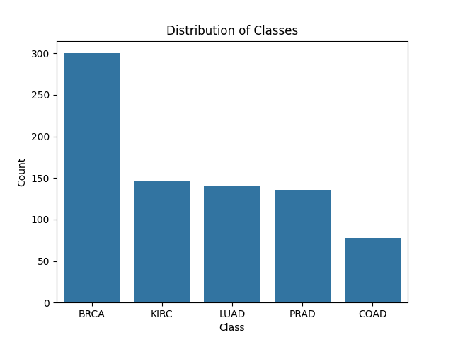
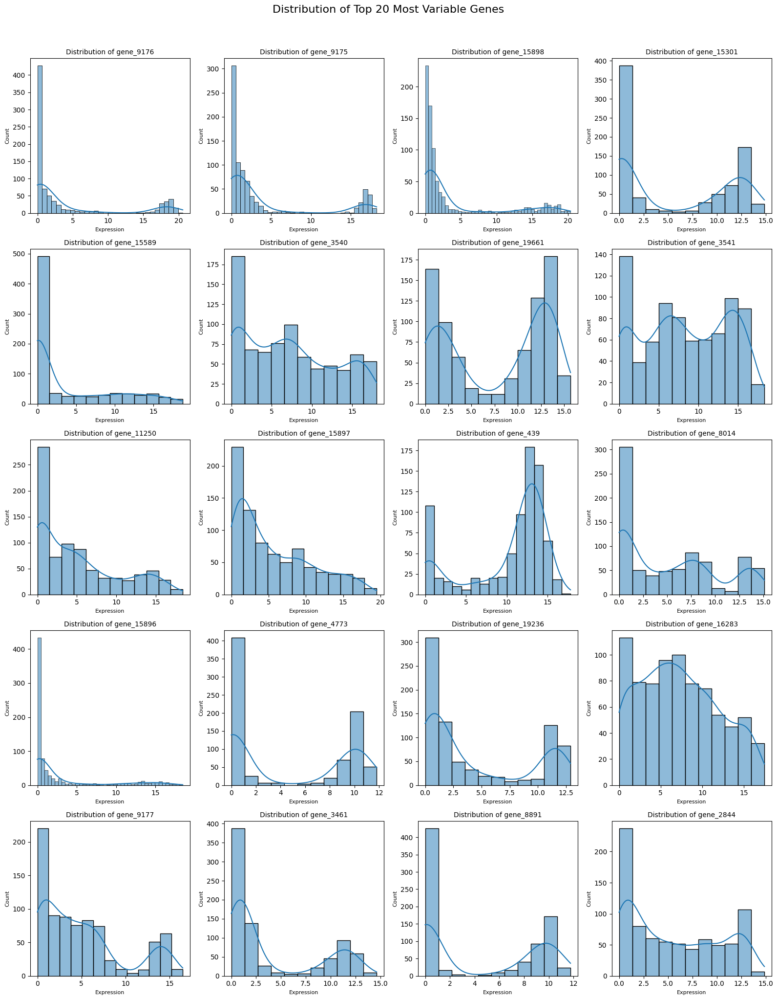
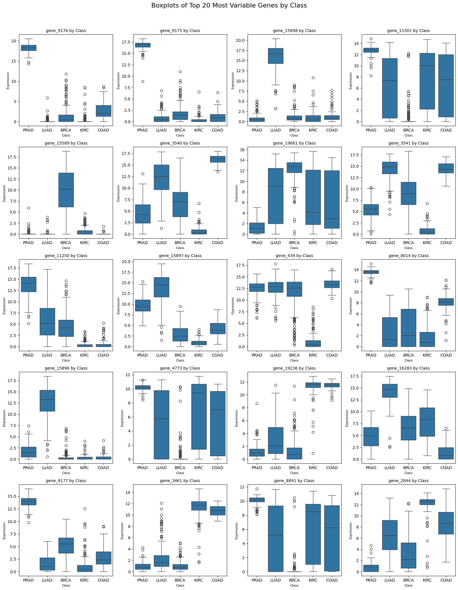
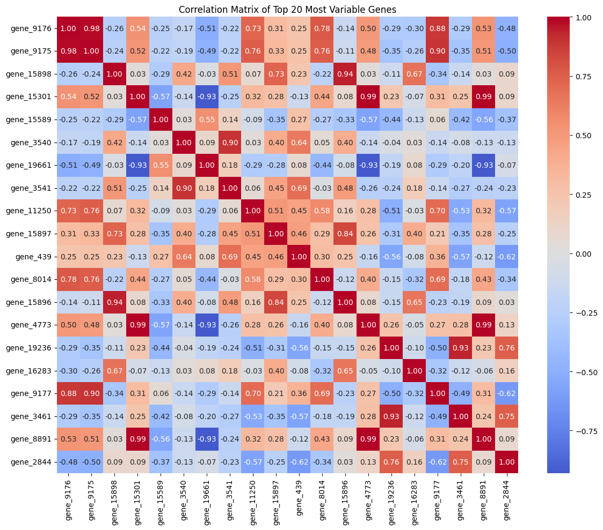
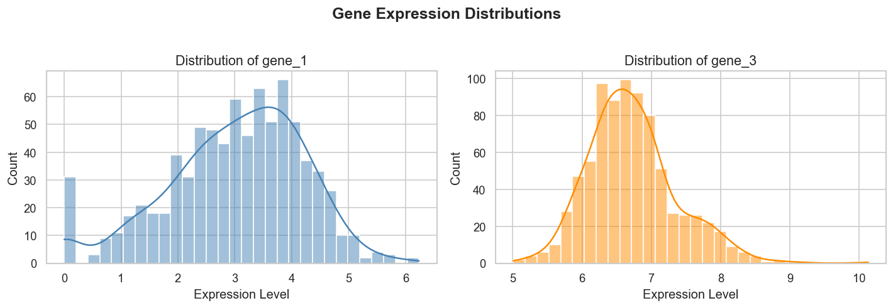
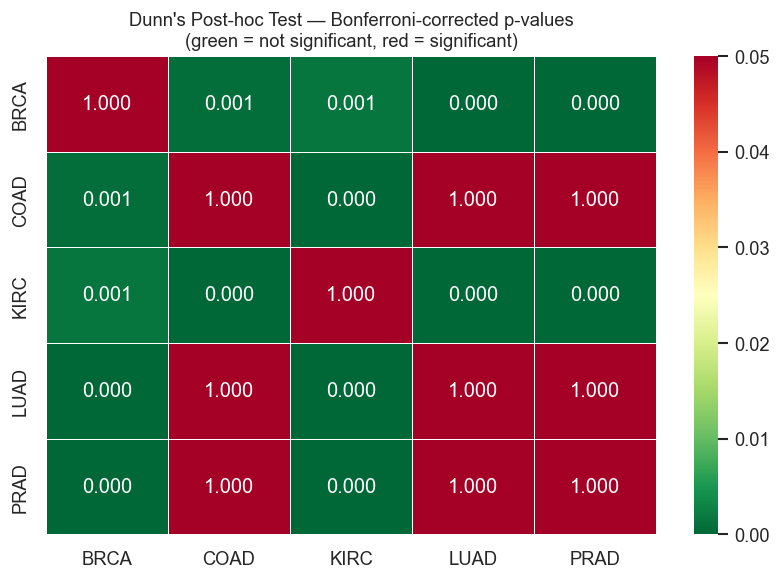
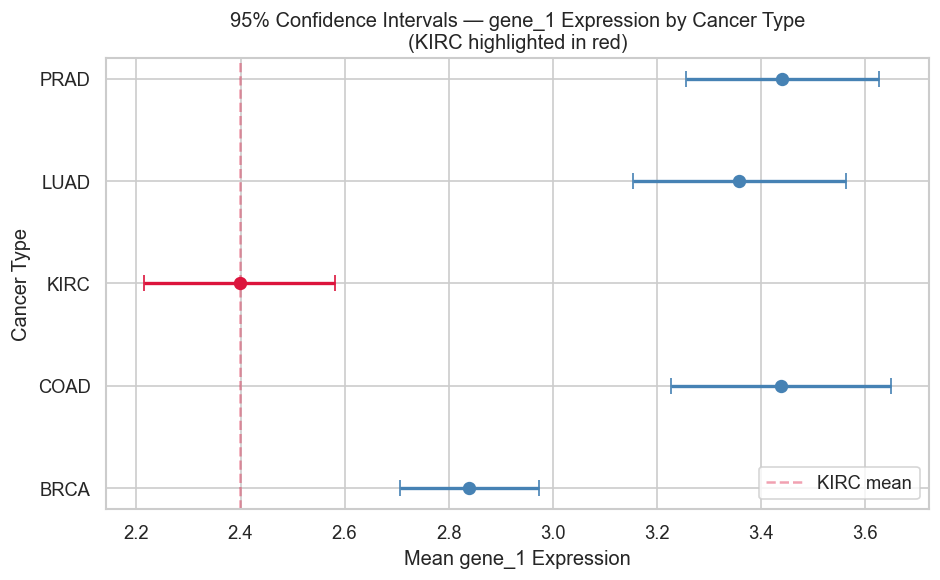

# Gene Expression in Cancer — RNA-Seq Analysis

## Overview

This repository contains two complementary analyses of RNA-seq gene expression data
from The Cancer Genome Atlas (TCGA), exploring whether gene expression patterns can
distinguish between different cancer types and identify candidate biomarker genes.

- **Dataset:** Gene Expression Cancer RNA-Seq — UCI ML Repository / TCGA
- **Samples:** 801 patients across 5 cancer types (BRCA, KIRC, LUAD, PRAD, COAD)
- **Features:** 20,531 gene expression values per sample
- **Goal:** Identify genes whose expression levels best separate cancer subtypes

---

## Project Structure

    gene-expression-analysis/
    │
    ├── data/
    │   ├── data.csv
    │   └── labels.csv
    ├── images/
    │   ├── class_distribution.png
    │   ├── top20_gene_distributions.png
    │   ├── top20_gene_boxplots.png
    │   └── top20_gene_correlation_matrix.png
    ├── notebook/
    │   ├── notebook.ipynb
    │   └── statistical_analysis.ipynb
    ├── stats_images/
    │   ├── distributions_gene1_gene3.png
    │   ├── dunn_posthoc_heatmap.png
    │   └── confidence_intervals_gene1.png
    ├── requirements.txt
    └── README.md

---

## Part 1 — Exploratory Data Analysis

### Methodology

1. Loaded and merged gene expression features with cancer type labels
2. Audited for missing values — none found
3. Explored class distribution across 5 cancer subtypes
4. Applied **variance filtering** to select the top 20 most variable genes
5. Analyzed univariate distributions of selected genes
6. Compared gene expression across cancer types using boxplots
7. Computed a correlation matrix among the top 20 genes

### Key Findings

- The dataset is **class imbalanced** — BRCA (Breast Cancer) accounts for 37.5% of samples
(300/801), reflecting historical prioritization in TCGA data collection
- Gene expression distributions are predominantly **right-skewed**, consistent with typical
RNA-seq data where most genes are lowly expressed
- Several genes show **bimodal distributions**, suggesting distinct expression subgroups
across cancer types
- Genes **3541**, **3540**, and **15897** show the strongest separation across cancer types
in group comparison analysis — strong biomarker candidates
- **BRCA** consistently displays the most distinct expression profile compared to other
cancer types
- Genes **4773**, **8891**, and **15301** form a tightly correlated cluster (*r* = 0.99),
suggesting shared regulatory mechanisms or pathway membership
- **Gene 19661** shows a strong negative correlation with this cluster (*r* = −0.93),
potentially reflecting competing regulatory mechanisms — a phenomenon commonly observed
in cancer biology

### Visualizations

#### Cancer Type Distribution

#### Top 20 Gene Expression Distributions

#### Gene Expression by Cancer Type (Boxplots)

#### Correlation Matrix — Top 20 Genes

---

## Part 2 — Statistical Analysis

### Methodology

1. Computed descriptive statistics (mean, median, std, CV) for gene_1, gene_2, gene_3 per cancer type
2. Tested normality using Shapiro-Wilk test and visualised distributions with histograms and KDE curves
3. Applied Kruskal-Wallis test to assess whether gene_1 expression differs across cancer types
4. Performed Dunn's post-hoc test with Bonferroni correction to identify which pairs differ
5. Computed and visualised 95% confidence intervals per cancer type for gene_1

### Key Findings

- **gene_3** is remarkably stable across all cancer types (CV < 9%), suggesting it is not
a strong differentiator between subtypes
- **gene_1** shows the highest variability (CV up to 47% in KIRC), making it the strongest
candidate for group comparison
- Both gene_1 and gene_3 are **non-normally distributed** (Shapiro-Wilk, p < 0.05),
justifying the use of non-parametric tests
- Kruskal-Wallis confirmed **significant differences in gene_1 expression across cancer
types** (H=89.89, p=1.39e-18)
- Dunn's post-hoc test revealed that **KIRC differs significantly from every other cancer
type** (all p < 0.05), while COAD, LUAD, and PRAD show no significant differences among
themselves
- The 95% CI plot shows **zero overlap** between KIRC and all other groups — KIRC mean
expression (≈2.40) sits approximately 1 full unit below COAD, LUAD, and PRAD

### Biological Interpretation

The consistent suppression of gene_1 expression in KIRC (Kidney Renal Clear Cell Carcinoma)
may reflect epigenetic silencing, metabolic reprogramming characteristic of renal cell
carcinoma, or tissue-of-origin transcriptional differences. These findings are statistically
robust but would require biological annotation and independent replication before clinical
conclusions can be drawn.

### Visualizations

#### Gene Expression Distributions (gene_1 and gene_3)

#### Dunn's Post-hoc Test — Bonferroni-corrected p-values

#### 95% Confidence Intervals — gene_1 by Cancer Type

---

## How to Run

1. Clone the repository:

       git clone https://github.com/Mesolongo/gene-expression-analysis.git
       cd gene-expression-analysis

2. Install dependencies:

       pip install -r requirements.txt

3. Open the EDA notebook:

       jupyter notebook notebook/notebook.ipynb

4. Open the statistical analysis notebook:

       jupyter notebook notebook/statistical_analysis.ipynb

> **Note:** Data files are not included due to size. Download them directly from
> [UCI ML Repository](https://archive.ics.uci.edu/dataset/401/gene+expression+cancer+rna+seq)

---

## Tools Used

- **Python 3**
- **Pandas** — data loading, merging, and manipulation
- **NumPy** — numerical computation
- **Matplotlib** — plot layout and customization
- **Seaborn** — statistical visualizations
- **SciPy** — statistical tests (Shapiro-Wilk, Kruskal-Wallis, confidence intervals)
- **scikit-posthocs** — Dunn's post-hoc test with Bonferroni correction
- **Jupyter Notebook** — interactive analysis environment